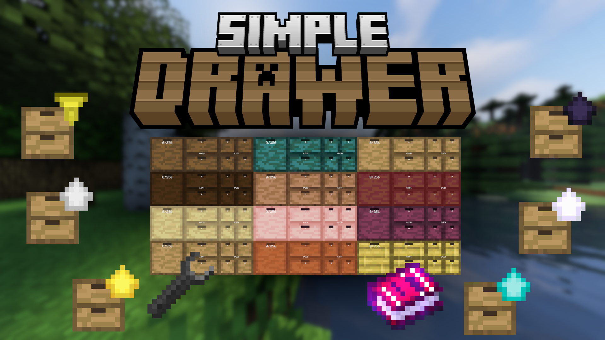

A simple datapack that add drawer to minecraft.


The most important item of the datapack is the guide, every player will receive it when joining the world for the first time.

Their is also a crafting recipe for the guide :

 

# Exploring the datapack :

This command will give you all items available in the datapack :
```/function simpledrawer:give```

In creative mod only : you can break the item frame, this will totally break the drawer.

# Some sources :
- StorageDrawer mod (idea and textures) : https://github.com/jaquadro/StorageDrawers

- Isometric rendering mod : https://github.com/glisco03/isometric-renders

- Smithed Crafting, Custom Block, ActionBar : https://github.com/Smithed-MC/Libraries

- LanternLoad : https://github.com/LanternMC/load

- ItemIO : https://github.com/edayot/ItemIO
